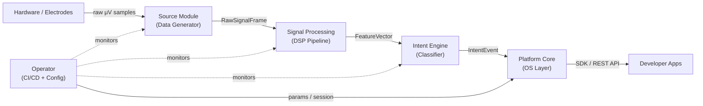
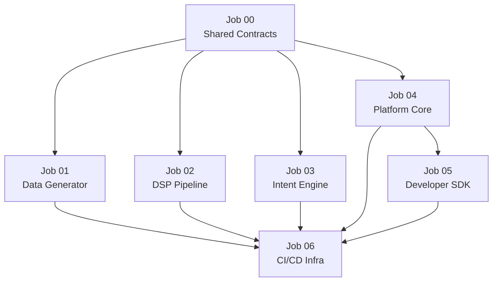

# NeuroOS Parallel Agent Architecture

## What We're Building

NeuroOS is a hardware-agnostic OS layer for BCIs. Drawing from BCI2000's proven four-module model (source → signal processing → user application → operator), NeuroOS adds a modern developer-SDK and AI-powered intent layer on top.

## BCI Signal Pipeline (from research paper)




## Agent Jobs — Folder Layout

```
jobs/
├── README.md
├── 00_shared_contracts/
├── 01_data_generator/
├── 02_dsp_pipeline/
├── 03_intent_engine/
├── 04_platform_core/
├── 05_developer_sdk/
└── 06_cicd_infra/
```

Each job folder contains:

- `JOB.md` — role, scope, input contract, output contract, forbidden scope
- `context/` — domain notes, reference algorithms, example payloads
- `schema/` — JSON Schema or TypeScript types defining the I/O boundary

---

## Job 00 — Shared Contracts (Prerequisite, ~1 hr)

**Agent:** Any (runs first, unblocks all others)

**Deliverables:**

- `schema/RawSignalFrame.ts` — typed frame: `{ deviceId, timestamp_ns, channels: Float32Array[], sample_rate_hz, signal_type: "EEG"|"EMG"|"ECOG" }`
- `schema/FeatureVector.ts` — `{ frame_id, band_powers: Record<BandName, number[]>, spatial_features: number[], artifact_flag }`
- `schema/IntentEvent.ts` — `{ intent_id, label: string, confidence: number, latency_ms, raw_features }`
- `schema/DeviceAdapter.ts` — abstract adapter interface all hardware drivers must implement
- `constants/signal_bands.ts` — delta 0.5–4 Hz, theta 4–8 Hz, alpha 8–12 Hz, beta 18–26 Hz, gamma 30–80 Hz

**Consumed by:** all other agents

---

## Job 01 — EEG/EMG Dummy Data Generator

**Agent:** Data Generator

**Role:** Simulate realistic BCI hardware. No real device needed — agents downstream can work and test immediately.

**Key outputs (`src/generators/`):**

- `EEGGenerator` — synthesizes multi-channel (8/16/64-ch) EEG at 160–256 Hz. Emits sensorimotor alpha/beta rhythms (8–12 Hz, 18–26 Hz), P300 evoked responses, slow cortical potentials, configurable SNR
- `EMGGenerator` — emits 20–500 Hz muscle artifact bursts on configurable channels
- `DeviceSimulator` — wraps generators, implements `DeviceAdapter` interface from Job 00, streams `RawSignalFrame` objects at real-time rate via EventEmitter
- `ScenarioLibrary` — canned scenarios: `"motor_imagery_left"`, `"motor_imagery_right"`, `"p300_target"`, `"rest"`, `"artifact_heavy"`
- `DataRecorder` — saves/replays `.ndf` (NeuroOS Data Format, ASCII header + binary samples, modeled after BCI2000)

**Input contract:** `DeviceAdapter` interface  
**Output contract:** `RawSignalFrame` stream

**Must NOT do:** filtering, classification, API routing

---

## Job 02 — Bio-Signal DSP Pipeline

**Agent:** Bio-Signal DSP Engineer

**Role:** Convert noisy raw frames into clean, calibrated feature vectors. This is the core of BCI2000's signal processing module — a cascade of independent signal operators.

**Key outputs (`src/dsp/`):**

- `Calibrator` — A/D units → microvolts linear transform, channel baseline correction
- `SpatialFilter` — pluggable: Common Average Reference (CAR), Laplacian derivation, CSP (Common Spatial Patterns)
- `ArtifactRejector` — EMG/ocular artifact detection using variance thresholds and Z-score
- `TemporalFilter` — pluggable operators: bandpass FIR, autoregressive (AR) spectral estimation (Burg method), P300 averaging, slow-wave moving average
- `FeatureExtractor` — computes band-powers (alpha/beta/gamma), event-related (de)synchronization (ERD/ERS), assembles `FeatureVector`
- `DSPPipeline` — orchestrator: chains operators, enforces <5 ms per-frame processing budget, emits processed `FeatureVector`

**Input contract:** `RawSignalFrame`  
**Output contract:** `FeatureVector`

**Must NOT do:** classification/ML, device I/O, API exposure

---

## Job 03 — Intent Engine

**Agent:** Intent Engine

**Role:** The AI brain of NeuroOS. Takes `FeatureVector` streams and emits high-confidence `IntentEvent` objects. Hardware-agnostic by design — only sees features, never raw signals.

**Key outputs (`src/intent/`):**

- `IntentClassifier` (base abstract) — pluggable model interface
- `LDAClassifier` — Linear Discriminant Analysis (fast, low-latency, baseline)
- `NeuralClassifier` — small CNN/LSTM on extracted band-power windows (PyTorch/ONNX runtime)
- `P300Detector` — threshold + template-matching for P300 evoked potential speller paradigm
- `MotorImageryDecoder` — left/right/rest 3-class from alpha/beta ERD
- `IntentNormalizer` — z-score normalizes class probabilities, applies adaptive baseline correction (matches BCI2000's normalizer stage)
- `OnlineTrainer` — streaming adaptation: updates LDA parameters from labeled feedback events
- `IntentEngine` — orchestrator, runs at 16 Hz inference loop, emits `IntentEvent`

**Input contract:** `FeatureVector`  
**Output contract:** `IntentEvent`

**Must NOT do:** DSP/filtering, HTTP APIs, hardware access

---

## Job 04 — Platform Core (The OS)

**Agent:** Platform Architect

**Role:** The iOS of the system. Provides the hardware registry, session lifecycle, event bus, and the developer-facing API surface.

**Key outputs (`src/platform/`):**

- `DeviceRegistry` — registers/unregisters `DeviceAdapter` implementations; auto-discovers USB/BLE/network devices; validates `RawSignalFrame` schema on connect
- `SessionManager` — manages recording sessions (start/pause/stop/resume), persists session metadata, emits lifecycle events
- `PipelineOrchestrator` — wires `DeviceAdapter → DSPPipeline → IntentEngine`; manages back-pressure; enforces end-to-end <15 ms latency SLA (per BCI2000 paper benchmark)
- `EventBus` — internal pub/sub: `signal.frame`, `dsp.features`, `intent.event`, `session.state`
- `ConfigStore` — YAML-based parameter store (sampling rate, filter settings, classifier weights path)
- `REST API` (Express/Fastify) — `POST /devices/register`, `GET /session/start`, `WS /stream/intents`
- `PluginSystem` — third-party `DeviceAdapter` registration without patching core

**Input contract:** `DeviceAdapter`, `IntentEvent`  
**Output contract:** REST/WebSocket API surface, `neuroos.config.yaml` schema

**Must NOT do:** implement DSP operators, train models, write test infra

---

## Job 05 — Developer SDK

**Agent:** SDK / DX Engineer

**Role:** Make NeuroOS developer-friendly. "No PhD required." Ships as `@neuroos/sdk` npm package and Python `neuroos` package.

**Key outputs (`sdk/`):**

- `TypeScript SDK` — `NeuroOS` client class, `useIntent()` React hook, typed event subscriptions
- `Python SDK` — `neuroos.connect()`, `neuroos.stream_intents()` async generator
- `Playground CLI` — `npx neuroos playground` connects to simulator (Job 01), streams live intents to terminal
- `App Templates` — `cursor-control`, `p300-speller`, `motor-imagery-game` starter apps
- `Docs site scaffold` — OpenAPI spec auto-generated from Platform Core, Docusaurus config

**Input contract:** Platform Core REST/WebSocket API  
**Output contract:** Published SDK packages, working example apps

**Must NOT do:** implement platform logic, modify DSP/Intent internals

---

## Job 06 — CI/CD & Infrastructure

**Agent:** CI/CD Manager

**Role:** Wires all modules together, provides the integration test harness, and enforces the build contract.

**Key outputs:**

- `docker-compose.yml` — spins up: `data-generator`, `dsp-pipeline`, `intent-engine`, `platform-core` as services
- `Makefile` — `make dev`, `make test`, `make lint`, `make benchmark`
- `GitHub Actions workflows` — `.github/workflows/ci.yml`: lint, unit tests, integration test (end-to-end latency check ≤15 ms)
- `Integration test harness` — runs `DeviceSimulator` → full pipeline → asserts `IntentEvent` arrives within latency budget and with correct label for each canned scenario
- `Benchmark suite` — measures output latency, latency jitter, system clock jitter (replicates Table I from BCI2000 paper)
- `monorepo config` — `pnpm-workspace.yaml` or `turborepo`, shared ESLint/Prettier/mypy configs

**Input contract:** all modules built and passing unit tests  
**Output contract:** green CI, benchmark report, docker-compose that starts the full stack

---

## Dependency & Parallelism Map




**Wave 1 (parallel, unblocked):** Job 00  
**Wave 2 (parallel, after Job 00):** Jobs 01, 02, 03, 04  
**Wave 3 (parallel, after Job 04):** Job 05  
**Wave 4 (final integration):** Job 06

---

## Tech Stack

- **Language:** TypeScript (Node.js 20) for platform/SDK; Python 3.11 for DSP/Intent Engine
- **DSP:** NumPy, SciPy, MNE-Python
- **ML:** PyTorch (training) + ONNX Runtime (inference, <5ms per frame)
- **API:** Fastify + `@fastify/websocket`
- **Monorepo:** pnpm workspaces + Turborepo
- **CI:** GitHub Actions
- **Containerization:** Docker Compose

## Each `JOB.md` will contain

1. Agent role title
2. Input contract (schema reference)
3. Output contract (schema reference + file paths)
4. Scope boundaries ("Must NOT do")
5. Acceptance criteria (what "done" looks like)
6. Relevant context links

